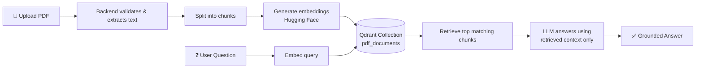

<div align="center">

# 🚀 Smart Dynamic RAG Assistant

**Upload a PDF. Ask questions. Get answers grounded in your document.**

A lightweight full-stack Retrieval-Augmented Generation (RAG) app — powered by FastAPI, Qdrant, and Hugging Face.


</div>

---

## 📖 Table of Contents

- [Overview](#-overview)
- [Tech Stack](#-tech-stack)
- [How It Works](#️-how-it-works)
- [Project Structure](#-project-structure)
- [Local Setup](#️-local-setup)
- [API Endpoints](#-api-endpoints)
- [Deployment Notes](#-deployment-notes)
- [Current Limitations](#️-current-limitations)
- [Typical Workflow](#-typical-workflow)

---

## 🧠 Overview

Smart Dynamic RAG Assistant is a small full-stack app that lets a user upload a PDF, index it into **Qdrant**, and ask questions about it. The backend extracts text, chunks it, generates embeddings via Hugging Face, stores the vectors in Qdrant, and uses the retrieved passages to ground the LLM's answers.

---

## 🧩 Tech Stack

| Layer | Technology |
|---|---|
| **Backend** | FastAPI · Uvicorn · Pydantic |
| **PDF Parsing** | pypdf |
| **Vector Database** | Qdrant Cloud |
| **Embeddings** | Hugging Face Inference API — `BAAI/bge-small-en-v1.5` |
| **LLM** | Hugging Face Chat Completions — `Llama 3.1 8B Instruct` |
| **Frontend** | HTML · CSS · JavaScript |

---

## 🏗️ How It Works



1. **Upload** — the user selects a PDF in the browser.
2. **Transfer** — the frontend converts it to base64 and posts it to the backend.
3. **Index** — the backend validates the PDF, extracts text, chunks it, and stores it in the `pdf_documents` Qdrant collection.
4. **Embed** — each chunk is embedded with the Hugging Face embedding model.
5. **Retrieve** — a question is embedded and matched against the closest chunks in Qdrant.
6. **Answer** — the most relevant passages are passed to the LLM, which answers using only that context.

---

## 📁 Project Structure

```text
Simple RAG Website/
├── backend/
│   ├── example.env
│   ├── main.py
│   └── requirements.txt
├── frontend/
│   └── index.html
├── README.md
├── requirements.txt
├── vercel.json
└── .gitignore
```

---

## ⚙️ Local Setup

### 1. Create a virtual environment

```bash
python -m venv .venv
```

**Windows (PowerShell):**
```powershell
.\.venv\Scripts\Activate.ps1
```

### 2. Install dependencies

```bash
pip install -r requirements.txt
```

### 3. Configure environment variables

Copy the example env file:

```bash
copy backend\example.env backend\.env
```

Fill in your credentials:

```env
HF_API_KEY=your_huggingface_api_key_here
QDRANT_URL=your_qdrant_url_here
QDRANT_API_KEY=your_qdrant_api_key_here
```

> 💡 The app reads these values from `backend/.env` using `python-dotenv`.

### 4. Run the backend

```bash
uvicorn main:app --app-dir backend --reload
```

| Resource | URL |
|---|---|
| API | http://127.0.0.1:8000 |
| Swagger Docs | http://127.0.0.1:8000/docs |

### 5. Open the frontend

Open `frontend/index.html` directly in a browser, or serve it via any static host. It automatically targets `http://127.0.0.1:8000` when run locally.

---

## 🔌 API Endpoints

<details>
<summary><strong>GET /api</strong> — Health check</summary>

Returns a simple startup message confirming the API is running.
</details>

<details open>
<summary><strong>POST /api/upload-json</strong> — Upload PDF</summary>

The main upload route used by the frontend. Sends the file as base64 to avoid large multipart payloads — better suited for Vercel deployments.

**Request body:**
```json
{
  "filename": "sample.pdf",
  "file_base64": "...base64 encoded PDF bytes..."
}
```
</details>

<details open>
<summary><strong>POST /api/ask</strong> — Ask a question</summary>

**Request body:**
```json
{
  "question": "What are the key findings in this document?"
}
```

**Response:**
```json
{
  "answer": "..."
}
```
</details>

---

## 🌐 Deployment Notes

This project ships with a basic `vercel.json` that serves:

- the FastAPI backend from `backend/main.py`
- the static frontend from `frontend/index.html`

The JSON upload route is used because browser uploads are base64-encoded, keeping request payloads within Vercel's limits.

> ⚠️ Make sure all required environment variables are configured in your deployment environment before use.

---

## ⚠️ Current Limitations

- 📏 Uploaded PDFs are capped at roughly **3 MB** (enforced on both frontend and backend).
- 🔄 The `pdf_documents` Qdrant collection is **recreated on every upload** — one document at a time.
- 🎯 The assistant answers **only from retrieved document chunks**, with no external context.

---

## ✅ Typical Workflow

1. **Upload** a PDF
2. **Wait** for it to be processed and indexed
3. **Ask** a question about its content
4. **Review** an answer grounded in the uploaded document

---

<div align="center">

*A hands-on project for learning end-to-end document Q&A — embeddings, vector search, and LLM prompting.*

</div>
